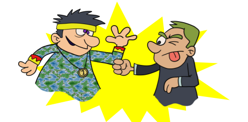
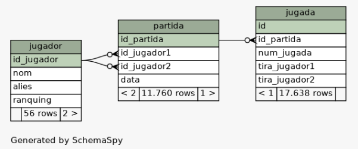
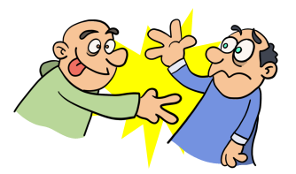
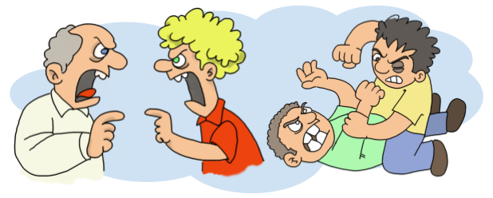

# Campionat mundial de Pedra, Paper Tisores

La federació mundial que organtitza les partides oficials de Pedra, Paper Tisores, han estat emmagatzemant els resultats de les partides que fan els seus jugadors en una base de dades que té aquesta estructura.

Ara volen publicitar un rànquing entre els seus jugadors. La classificació es fa en funció de dos criteris:

1.  El primer lloc (el de campió del món) es determina:

    * Si no hi ha cap campió el primer que guanya és el campió
    * Si algú guanya al que va primer es converteix en el primer (no importa que no hagi guanyat cap partida)
    * El campió es manté fins que perdi una partida (encara que tingui menys punts que els altres)

2.  Els altres llocs es determinen ordenadament en funció de:
    * Les vegades que han estat campions del món
    * Les vegades que han guanyat partides

Durant aquest mes han fet un grapat de partides i hi ha una polèmica sobre qui és el campió del món (diuen que fins i tot hi va haver alguna baralla)

## Tasca

Necessiten un programa que els calculi qui és el campió del món actual. El campió que hi havia abans és un dels que fa la primera partida.

> Podeu obtenir una còpia de la base de dades d’aquí [Descarregar](https://drive.google.com/file/d/1Q2jZg48FqWRd69zlFKx58R78yTvy6Tv8/view?usp=sharing)
